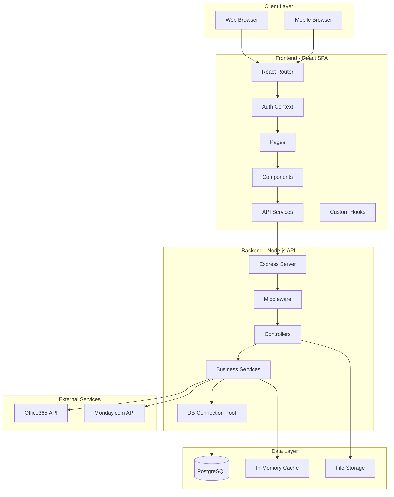
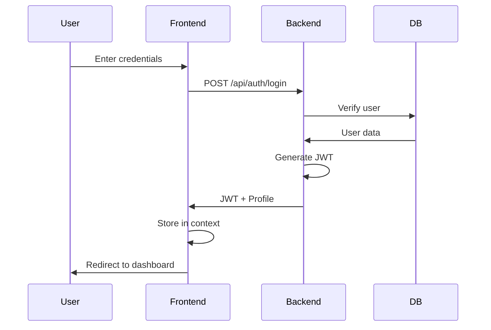
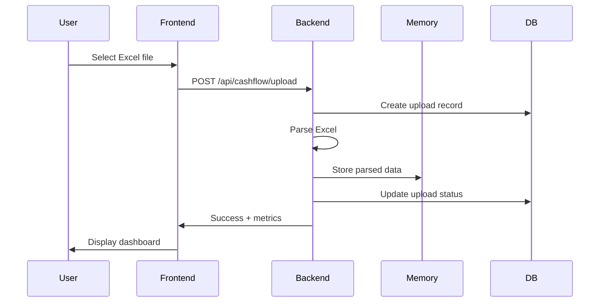
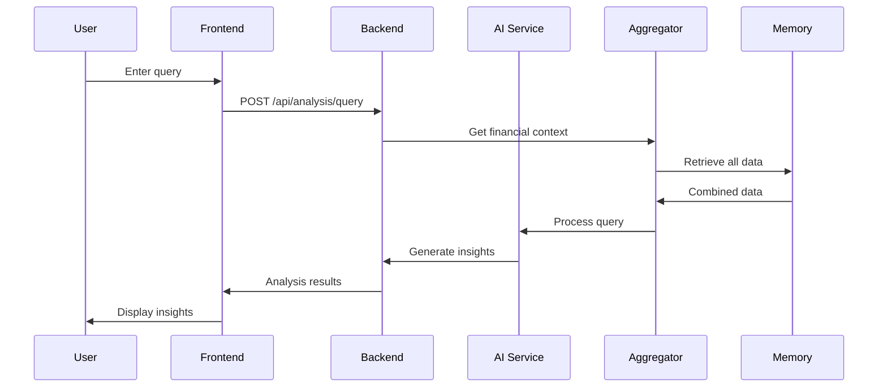

# Warren v2-Analysis Complete Architecture

## Table of Contents
1. [System Overview](#system-overview)
2. [Architecture Diagram](#architecture-diagram)
3. [Backend Architecture](#backend-architecture)
4. [Frontend Architecture](#frontend-architecture)
5. [Database Schema](#database-schema)
6. [Data Flow](#data-flow)
7. [Security Architecture](#security-architecture)
8. [API Reference](#api-reference)
9. [Deployment Architecture](#deployment-architecture)

## System Overview

Warren is a secure financial management dashboard designed for C-level executives, providing comprehensive cashflow analysis, P&L reporting, and AI-powered financial insights.

### Key Features
- **Dual Data Sources**: Office365 Excel integration + manual file uploads
- **Real-time Analysis**: Cashflow forecasting, burn rate analysis, runway calculations
- **AI Insights**: Natural language queries for financial analysis
- **Multi-currency Support**: ARS, USD, EUR, BRL with real-time conversion
- **Internationalization**: English and Spanish support
- **Enterprise Security**: JWT authentication, encrypted data storage

### Technology Stack
- **Frontend**: React 18 + TypeScript + Vite + Tailwind CSS
- **Backend**: Node.js + Express + TypeScript
- **Database**: PostgreSQL 14+
- **Authentication**: JWT with bcrypt
- **Charts**: Chart.js + Recharts
- **File Processing**: ExcelJS + Multer

## Architecture Diagram



## Backend Architecture

### Directory Structure
```
backend/
├── src/
│   ├── index.ts              # Entry point
│   ├── controllers/          # Request handlers
│   ├── services/            # Business logic
│   ├── routes/              # API endpoints
│   ├── middleware/          # Express middleware
│   ├── config/              # Configuration
│   ├── interfaces/          # TypeScript interfaces
│   └── utils/              # Utilities
├── dist/                    # Compiled output
└── package.json
```

### Core Components

#### 1. Controllers (Request Handlers)

| Controller | Purpose | Key Methods |
|------------|---------|-------------|
| **AuthController** | User authentication | `login()`, `logout()`, `getProfile()` |
| **CashflowController** | Cashflow management | `uploadFile()`, `getDashboard()`, `getMetrics()`, `getRunwayAnalysis()`, `getBurnRateAnalysis()` |
| **PnLController** | P&L reporting | `uploadPnL()`, `getDashboard()`, `getLineItems()` |
| **AIAnalysisController** | AI-powered insights | `analyzeQuery()`, `getDataSummary()`, `getSuggestedQueries()` |
| **ConfigurationController** | System config | Company settings management |
| **CurrencyController** | Exchange rates | Currency conversion endpoints |

#### 2. Services (Business Logic)

| Service | Pattern | Responsibility |
|---------|---------|----------------|
| **CashflowServiceV2** | Singleton | Excel parsing, metrics calculation, dashboard generation |
| **PnLService** | Singleton | P&L data processing, margin calculations |
| **ExtendedFinancialService** | Singleton | Operational costs, investments, taxes, banks |
| **FinancialDataAggregator** | Standard | Unifies data from multiple services |
| **AIAnalysisService** | Singleton | NLP query processing, insight generation |
| **CashFlowAnalysisService** | Standard | Advanced analytics (runway, burn rate, scenarios) |
| **FileUploadService** | Standard | File tracking and database persistence |
| **UserService** | Standard | User management, authentication |

#### 3. Middleware Stack

```javascript
// Applied in order:
1. CORS (whitelist-based)
2. Helmet (security headers)
3. Morgan (logging)
4. Body Parser (JSON)
5. Rate Limiter (1000 req/min)
6. Authentication (JWT validation)
7. Error Handler (centralized)
```

#### 4. Data Storage Strategy

- **PostgreSQL**: Users, file uploads, configuration
- **In-Memory**: Parsed financial data (singleton services)
- **Temporary Files**: Excel uploads (cleaned after processing)

## Frontend Architecture

### Directory Structure
```
frontend/
├── src/
│   ├── App.tsx              # Root component
│   ├── main.tsx            # Entry point
│   ├── pages/              # Route components
│   ├── components/         # Reusable UI
│   ├── services/          # API clients
│   ├── contexts/          # React contexts
│   ├── hooks/             # Custom hooks
│   ├── utils/             # Utilities
│   ├── assets/            # Static assets
│   └── i18n/              # Translations
├── public/                 # Public assets
└── dist/                   # Build output
```

### Component Hierarchy

```
App
├── AuthProvider
│   ├── Router
│   │   ├── PublicRoute
│   │   │   ├── LandingPage
│   │   │   ├── LoginPage
│   │   │   └── LegalPage
│   │   └── ProtectedRoute
│   │       ├── DashboardLayout
│   │       │   ├── Sidebar
│   │       │   ├── TopBar
│   │       │   └── Content
│   │       │       ├── MainDashboard
│   │       │       ├── CashflowDashboard
│   │       │       ├── PnLDashboard
│   │       │       ├── AnalysisPage
│   │       │       └── ConfigurationPage
│   │       └── DemoLayout
│   │           └── Demo Pages
```

### Key Pages

| Page | Route | Purpose |
|------|-------|---------|
| **MainDashboard** | `/dashboard` | Overview with widget grid |
| **CashflowDashboard** | `/cashflow` | Detailed cashflow analysis |
| **PnLDashboard** | `/pnl` | P&L reports and metrics |
| **AnalysisPageFixed** | `/analysis` | AI-powered analysis interface |
| **ConfigurationPage** | `/configuration` | Company and system settings |
| **TeamAssignmentsPage** | `/team-assignments` | Team management |

### State Management

1. **AuthContext**: Global authentication state
2. **useCurrency Hook**: Currency selection and conversion
3. **Local State**: Component-specific state
4. **Service Singletons**: Cached API responses

### UI Components

| Component | Purpose |
|-----------|---------|
| **CashflowChart** | Interactive cashflow visualization |
| **PnLChart** | P&L trends and comparisons |
| **MetricCard** | KPI display widget |
| **DataValidationChart** | Upload validation feedback |
| **FileUpload** | Excel file upload interface |
| **LanguageSelector** | i18n language switcher |
| **CurrencySelector** | Multi-currency selector |

## Database Schema

### Tables

#### 1. users
```sql
CREATE TABLE users (
    id SERIAL PRIMARY KEY,
    email VARCHAR(255) UNIQUE NOT NULL,
    password_hash VARCHAR(255) NOT NULL,
    company_name VARCHAR(255),
    created_at TIMESTAMP DEFAULT CURRENT_TIMESTAMP,
    updated_at TIMESTAMP DEFAULT CURRENT_TIMESTAMP,
    is_active BOOLEAN DEFAULT TRUE
);
```

#### 2. file_uploads
```sql
CREATE TABLE file_uploads (
    id SERIAL PRIMARY KEY,
    user_id INTEGER REFERENCES users(id),
    file_type VARCHAR(50) CHECK (file_type IN ('cashflow', 'pnl', 'other')),
    filename VARCHAR(255) NOT NULL,
    processing_status VARCHAR(50) DEFAULT 'pending',
    is_valid BOOLEAN DEFAULT FALSE,
    data_summary JSONB,
    period_start DATE,
    period_end DATE,
    created_at TIMESTAMP DEFAULT CURRENT_TIMESTAMP,
    deleted_at TIMESTAMP
);
```

### Database Views
- **active_file_uploads**: Non-deleted uploads with user info
- **latest_file_uploads**: Most recent valid upload per type per user

## Data Flow

### 1. Authentication Flow


### 2. File Upload Flow


### 3. Analysis Query Flow


## Security Architecture

### Authentication & Authorization
- **Method**: JWT Bearer tokens
- **Expiry**: 24 hours
- **Storage**: httpOnly cookies (production)
- **Password**: bcrypt with 10 rounds

### API Security
```javascript
// Security middleware stack
app.use(helmet()); // Security headers
app.use(cors({ whitelist })); // CORS protection
app.use(rateLimit({ max: 1000 })); // Rate limiting
app.use(authMiddleware); // JWT validation
```

### Data Protection
- **In Transit**: HTTPS everywhere
- **At Rest**: Database encryption
- **Passwords**: bcrypt hashing
- **File Uploads**: Virus scanning (planned)
- **Input Validation**: All endpoints validated

### Security Headers
```
X-Frame-Options: SAMEORIGIN
X-Content-Type-Options: nosniff
X-XSS-Protection: 1; mode=block
Strict-Transport-Security: max-age=31536000
```

## API Reference

### Base URL
```
Production: https://api.warren.vortex.com
Development: http://localhost:3001
```

### Authentication
All protected endpoints require:
```
Authorization: Bearer <JWT_TOKEN>
```

### Core Endpoints

#### Auth Endpoints
```
POST   /api/auth/login          # User login
POST   /api/auth/logout         # User logout  
GET    /api/auth/profile        # Get profile
```

#### Cashflow Endpoints
```
POST   /api/cashflow/upload     # Upload Excel
GET    /api/cashflow/dashboard  # Dashboard data
GET    /api/cashflow/metrics    # Raw metrics
GET    /api/cashflow/analysis/runway      # Runway analysis
GET    /api/cashflow/analysis/burn-rate   # Burn rate
POST   /api/cashflow/analysis/scenario    # What-if scenarios
```

#### P&L Endpoints
```
POST   /api/pnl/upload          # Upload P&L
GET    /api/pnl/dashboard       # P&L dashboard
GET    /api/pnl/metrics         # Monthly metrics
GET    /api/pnl/line-items      # Detailed items
```

#### Analysis Endpoints
```
POST   /api/analysis/query      # AI analysis
GET    /api/analysis/data-summary        # Data overview
GET    /api/analysis/suggestions         # Query suggestions
GET    /api/analysis/uploads            # Upload history
```

### Response Format
```json
{
  "success": true,
  "data": { ... },
  "message": "Operation successful",
  "timestamp": "2024-01-19T10:00:00Z"
}
```

### Error Format
```json
{
  "success": false,
  "error": {
    "code": "VALIDATION_ERROR",
    "message": "Invalid input",
    "details": { ... }
  }
}
```

## Deployment Architecture

### Production Stack
```
┌─────────────────┐
│   CloudFlare    │ ← CDN + DDoS Protection
└────────┬────────┘
         │
┌────────┴────────┐
│   Nginx Proxy   │ ← SSL Termination
└────────┬────────┘
         │
┌────────┴────────┐     ┌──────────────┐
│   PM2 Cluster   │ ←→  │  PostgreSQL  │
│  (Node.js x2)   │     │   Database   │
└─────────────────┘     └──────────────┘
         │
┌────────┴────────┐
│  Static Files   │ ← React Build
└─────────────────┘
```

### Environment Configuration
- **Development**: Local with hot reload
- **Staging**: Vercel preview deployments
- **Production**: AWS Lightsail with PM2

### Monitoring
- **Application**: PM2 monitoring
- **Logs**: Centralized in /var/log/warren/
- **Database**: pg_stat monitoring
- **Uptime**: External monitoring service

This architecture provides a scalable, secure, and maintainable foundation for the Warren financial dashboard application.